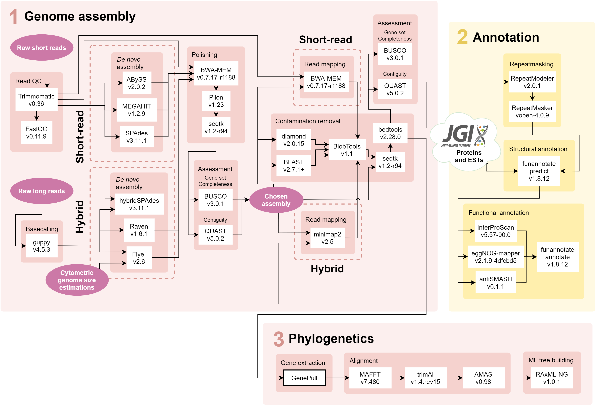

# Endophyte Genomes
 

The pipeline was written for and run on Queen Mary University of London's [Apocrita HPC facility](http://doi.org/10.5281/zenodo.438045) which uses the Univa Grid Engine batch-queue system. This means that many of the bash scripts (`.sh` file endings) specify core allocation, run times and memory usage allocation that may need to be adapted for different platforms.

---

## 1 Read trimming/basecalling

`cd reads`

### Short-reads

1. `qsub trimmomatic.sh` trims raw reads using [Trimmomatic](http://www.usadellab.org/cms/?page=trimmomatic); requires `NexteraPE-PE.fa` file with adapter sequences downloaded from [here](https://github.com/timflutre/trimmomatic/blob/master/adapters/NexteraPE-PE.fa) (for Illumina NovaSeq 6000 151bp paired-end reads).
2. `qsub fastqc.sh` checks trimmed read quality with [FastQC](https://www.bioinformatics.babraham.ac.uk/projects/fastqc/).

### Long-reads

`qsub guppy.sh` performs fast basecalling of raw MinION read data.

## 2 *De novo* genome assembly

`cd denovo_assembly`

1. `./submit_assembly.sh` makes new directory and submits job scripts for each assembly tool - short-read tools `abyss.sh` ([ABySS](https://github.com/bcgsc/abyss)), `megahit.sh` ([MEGAHIT](https://github.com/voutcn/megahit)) and `spades.sh` ([SPAdes](https://github.com/ablab/spades)), and long-read tools `flye.sh` ([Flye](https://github.com/fenderglass/Flye)), `raven.sh` ([Raven](https://github.com/lbcb-sci/raven)) and `spades_hybrid` (hybridSPAdes). For all tools except for ABySS, these scripts also include short-read mapping with [BWA-MEM](https://github.com/lh3/bwa) for polishing with [Pilon](https://github.com/broadinstitute/pilon) and remove sequences <200bp using [Seqtk](https://github.com/lh3/seqtk) for NCBI compliance.
2. `qsub -t 1-8 abyss_comp.sh` compares the assembly stats to choose 'best' kmer size for ABySS (must be done after `abyss.sh` has finished for all kmer sizes and strains), followed by short-read polishing with Pilon.

## 3 Assessment

`cd assessment`

### Assembly tool comparison

1. `./submit_assessment` submits scripts for assembly quality statistics - `quast.sh` ([QUAST](https://github.com/ablab/quast)) and `busco.sh` ([BUSCO](https://busco.ezlab.org/)), which requires the ascomycota_odb10.2020-09-10 BUSCO dataset downloaded from [here](https://busco-data.ezlab.org/v4/data/lineages/)) - and `blast.sh` ([BLAST](https://blast.ncbi.nlm.nih.gov/Blast.cgi)), `diamond.sh` ([DIAMOND](https://github.com/bbuchfink/diamond)) and `read_mapping.sh`, which maps reads with BWA-MEM, to produce input for BlobTools.
2. `qsub -t 1-15 blobtools.sh` submits `blobtools.sh` to run [BlobTools](https://github.com/DRL/blobtools) (must be done after `blast.sh`, `diamond.sh` and `read_mapping.sh` have finished for the strain(s) in question).

### Contamination filtering

1. `qsub -t 1-15 remove_contam.sh` removes contigs which BlobTools flagged as belonging to the wrong taxonomic class.
2. `qsub -t 1-15 ncbi_filter.sh` removes or trims contigs flagged as mitochondrial or adapter contaminations during NCBI submission with the help of[bedtools](https://bedtools.readthedocs.io/en/latest/); requires *strain*_ncbi_remove.txt and *strain*_ncbi_trim.bed files.

### Final quality statistics

1. `qsub quast_final.sh` reruns QUAST on the contaminant-filtered assemblies.
2. `qsub busco_final.sh` reruns BUSCO on the contaminant-filtered assemblies.
3. `qsub -t 1-15 read_mapping_final.sh` performs a final round of read mapping and produces mapping statisics with [SAMtools](http://www.htslib.org/) to calculate both short- and long-read coverage.

## 4 Annotation

`cd annotation`

### Repeat masking

`cd annotation/repeat_masking`

1. `qsub -t 1-15 repeatmodeler` makes custom repeat library for each strain using [RepeatModeler](https://www.repeatmasker.org/RepeatModeler/).
2. `qsub -t 1-15 repeatmasker.sh` uses the custom repeat libraries to softmask assemblies using [RepeatMasker](https://www.repeatmasker.org/RepeatMasker/).

### Structural annotation

`cd annotation/structural`

`qsub -t 1-15 funannotate.sh` sorts and relabels contigs in the repeatmasked assembly before predicting gene models using [funannotate](https://github.com/nextgenusfs/funannotate). Requires protein and EST evidence downloaded from [Mycocosm](https://mycocosm.jgi.doe.gov/mycocosm/home) to be saved in this folder.

### Functional annotation

`cd annotation/functional`

1. `qsub -t 1-15 eggnogmapper.sh` submits [eggNOG-mapper](https://github.com/eggnogdb/eggnog-mapper) on predicted gene models.
2. `qsub -t 1-15 antismash.sh` submits [antiSMASH](https://github.com/antismash/antismash) on predicted gene models.
3. `qsub -t 1-15 interproscan.sh` submits [InterProScan](https://github.com/ebi-pf-team/interproscan) on predicted gene models.
4. `qsub -t 1-15 funannotate_annotate.sh` maps results from the previous three programmes onto the structural annotation and produces the `.sqn` files for NCBI submission.

## 5 Phylogenetics

`cd phylogenetics`

This folder contains a file - `lineages` - listing the 10 lineages for which trees must be built and the strains that belong to said lineages, and a file - `markers` - listing the 13 genetic markers selected for building the trees.

### Gene extraction

`cd GenePull`

`./genepull.sh` submits [GenePull](https://github.com/Rowena-h/MiscGenomicsTools/tree/main/GenePull) to extract selected genetic markers from contaminant filtered assemblies of each strain. Requires fasta files containing a single example sequence from a closely related taxon for each genetic marker being extracted.

### Alignment

1. `file_prep.sh` contains example one-liners for formatting sequence headers in each of the gene alignment fasta files so that they are identical across different genes (i.e. removing GenBank accessions; removing misc text after taxon names/vouchers; replacing spaces with underscores etc).
2. `qsub -t 1-10 align.sh` submits gene alignments using [MAFFT](https://github.com/GSLBiotech/mafft) and trimming using [trimAl](https://github.com/inab/trimal) for each of the 10 lineages.
3. Gene alignments are manually checked with [AliView](https://github.com/AliView/AliView).
4. `qsub -t 1-10 concat.sh` submits concatenation of all gene alignments with [AMAS](https://github.com/marekborowiec/AMAS) for each of the 10 lineages.

### ML tree building

`qsub -t 1-10 raxmlng.sh` submits [RAxML-NG](https://github.com/amkozlov/raxml-ng) with bootstrapping until convergence or up to 1,000 replicates (whichever first) for each of the 10 lineages.
